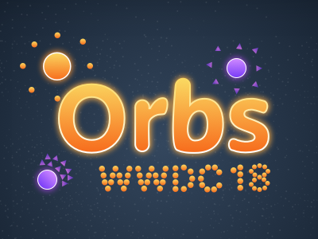

## Introduction
This playground is an **accepted** submission for the WWDC18 Scholarship and features a game where you control a player with four different abilities that allow it to manipulate smaller entities, called Orbs. The objective is to survive through the waves of enemies before ultimately defeating The Boss. To achieve this, you will have to collect Power-Ups and decide correctly when to use your orbs for attack or defence.

## Credits
- SpriteKit Analog Stick by [MitrophD](https://github.com/MitrophD)
- "Nice Kitty" by [Cimba](https://cimba.newgrounds.com/)
